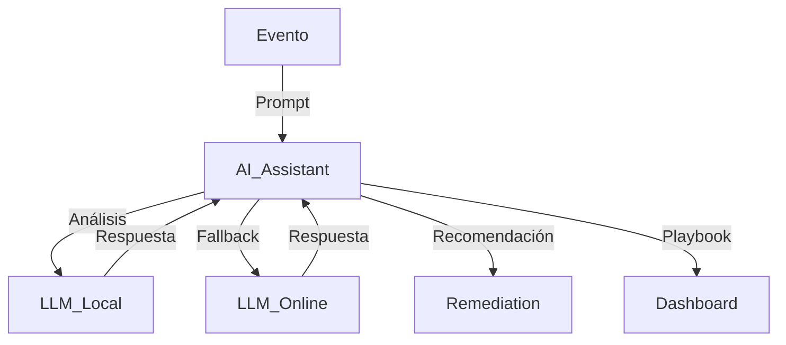

# Manual Operativo: AI Assistant (ARES-11)

## 1. Descripción Operativa
El módulo AI Assistant conecta ARES-11 con modelos de IA locales (Ollama, LM Studio) y en línea (Azure OpenAI, HuggingFace) para análisis de eventos, generación de recomendaciones y playbooks automáticos.

## 2. Propósito Operativo
- Analizar eventos y logs con IA generativa
- Recomendar acciones defensivas y ofensivas
- Sugerir playbooks automatizados
- Integrar IA local y cloud para resiliencia

## 3. Procedimientos Operativos Estándar (SOP)
- Configurar Ollama/LM Studio en localhost:11434
- (Opcional) Configurar Azure OpenAI con variables de entorno
- Llamar a `aiAssistant.recommendAction(evento)` desde cualquier módulo
- Usar la respuesta para enriquecer alertas, playbooks o reportes

## 4. Flujo Operativo
- Entradas: eventos, logs, alertas
- Procesamiento: análisis IA local → fallback IA online
- Salidas: recomendaciones, playbooks, justificaciones
- Integración: remediation, threat-mapper, dashboard

## 5. KPIs y Señales Clave
- Tiempo de respuesta IA
- % de eventos enriquecidos
- Playbooks generados automáticamente

## 6. Integración con el Dashboard Táctico
- Visualizar recomendaciones IA en paneles de alertas
- Mostrar justificaciones y acciones sugeridas

## 7. Integración con el Orquestador
- Llamar a AI Assistant ante eventos críticos
- Automatizar respuesta según sugerencias IA

## 8. Escenarios Operativos
- Análisis de incidente con IA local
- Fallback a IA online si local no responde
- Generación de playbook ante ataque avanzado

## 9. Relación con Estándares
- CIS 16, NIST SI-4, MITRE ATT&CK (Tactic: TA0001-TA0007)

## 10. Resumen Ejecutivo Operativo
AI Assistant dota a ARES-11 de capacidades cognitivas avanzadas, acelerando la respuesta y mejorando la resiliencia.

## 11. Ejemplo de Despliegue Rápido
```sh
# Lanzar Ollama o LM Studio local
ollama serve &
# Configurar variables de entorno para Azure OpenAI (opcional)
export AZURE_OPENAI_URL="https://..."
export AZURE_OPENAI_KEY="..."
```

## 12. Diagrama Operativo


## 13. Requisitos Previos
- Node.js >= 18
- Ollama o LM Studio local (opcional: Azure OpenAI)

## 14. Enlaces Cruzados
- [README AI Assistant](../core/ai-assistant/README.md)
- [Dashboard](dashboard.md)
- [Remediation](remediation/manual_remediation.md)

## 15. Volver al Índice Maestro
[Índice Maestro](index.md)
